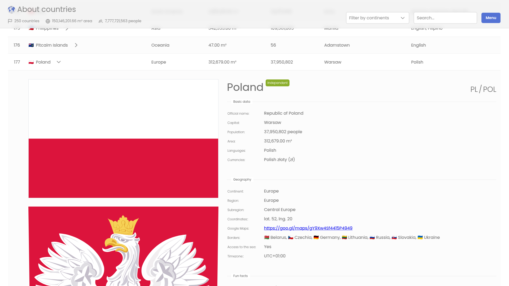

# About Countries

**About Countries** is a web application created to provide an interactive visualization of country data, inspired by the [REST Countries API](https://restcountries.com) and using it. The application aims to make country-specific information accessible and visually appealing, allowing users to explore, compare, and analyze various country metrics with ease.

## Overview

This project serves as a technical showcase, highlighting skills in frontend development, particularly in API integration, state management, and component-based UI design. **About Countries** demonstrates an efficient and user-friendly approach to data visualization by leveraging popular technologies and best practices. This project is intended as a demonstration and will not be actively maintained.



## Key Features

* **Up-to-Date Country List:** Displays a comprehensive list of all countries, including essential information such as population, region, and flag.
* **Detailed Country Information:** Allows users to view in-depth details for selected countries, including area, population, time zones, currencies, and neighboring countries.
* **Search and Filter Options:** Provides options to locate countries by name, region, or specific attributes.
* **Country Comparison:** Enables side-by-side comparisons of selected countries, making it easier to analyze and contrast their data.

These features create an engaging, informative experience that facilitates exploration of global data.

## Challenges & Solutions

During development, two main challenges were addressed:

1. Creating an Intuitive and Modern User Interface: Using PrimeNG components allowed for a visually appealing, user-friendly interface while maintaining consistency and responsiveness.
2. Achieving Modern, High-Quality Code: Following best practices with Angular and NgRx ensured clean, maintainable code and effective state management, which were essential for a smooth user experience and efficient data handling.

## Key Technologies & Tools

- **Framework:** Angular, for the application’s core structure and component-based architecture.
- **State Management:** NgRx, enabling smooth data flow and efficient state handling.
- **UI Components:** PrimeNG, providing consistent and responsive UI elements to create a modern look and feel.

## Project Structure

The project structure will be documented here to illustrate its modular and organized design.

```plaintext
src/
├── example                  # Examples for development purposes
├── public                   # Assets folder
├── src
│   ├── app                  # Application code
│   │   ├── core             # Things that last the life of the app
│   │   │   ├── constants
│   │   │   ├── models
│   │   │   ├── modules
│   │   │   └── store
│   │   ├── modules          # Things related to business features
│   │   └── shared           # Things shared between business functionalities
│   │       ├── components 
│   │       ├── constants
│   │       ├── containers
│   │       ├── models
│   │       ├── pipes
│   │       ├── services
│   │       └── utils
│   └── styles               # Global styles
└── tools                    # Tools for development purposes
```

## Installation and Running the Application

To install and run the **About Countries** application locally, follow these steps:

1. **Install Required Tools**  
   Ensure you have the following installed:

- **Node.js** (>=18.x) – [Download Node.js](https://nodejs.org)
- **Angular CLI** (>=18.x) – Install globally:
  ```bash
  npm install -g @angular/cli
  ```

2. **Clone the Repository**  
   Clone the GitHub repository and navigate to the project folder:
   ```bash
   git clone <repository-url>
   cd about-countries-ng
   ```

3. **Install Dependencies**  
   Install the required npm packages:
   ```bash
   npm install
   ```

4. **Run the Application in Development Mode**  
   Start the development server:
   ```bash
   npm start
   ```

## Troubleshooting

If you encounter issues with the application, try the following solutions:

1. **Error: "Module not found"**  
   Make sure you have installed all the dependencies by running `npm install`.

2. **Issue with API request**  
   Check your internet connection or the status of the REST Countries API.

3. **Application Display Issue**  
   If you experience problems with the layout or rendering, try clearing the browser cache or testing the application in a different browser.

4. **General Issues or Bugs**  
   If you encounter any other issues with the application or its functionality, please report them by creating an issue on the [GitHub Issues page](https://github.com/piotrmludzik/about-countries-ng/issues).

## License

This project is licensed under the MIT License - see the [LICENSE](LICENSE) file for details.
